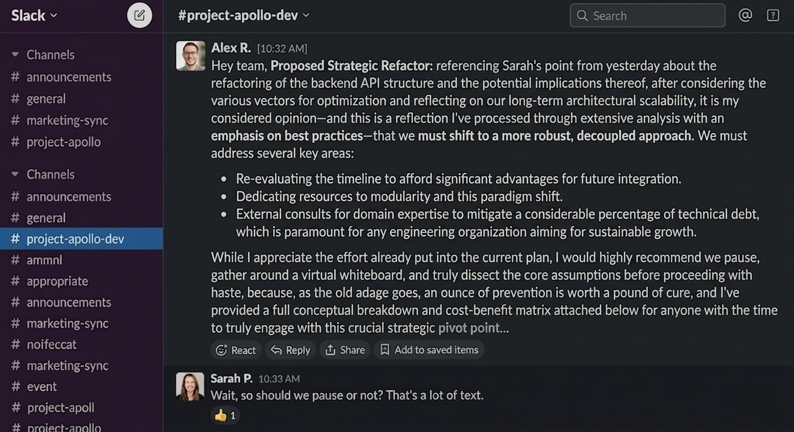

AI is a genuinely useful tool. It can handle the most boring parts of the job, speed up time consuming tasks, and help avoid embarrassing typos or grammar mistakes. Used well, it can significantly improve productivity.

I believe opinions are expensive. They're high maintenance, low-value, and far too easy to acquire, so I try to keep as few of them as possible. Recently, though, I had to add a new one: **I hate AI-generated conversations.**

Even in my mother tongue, I make plenty of typos. AI is incredibly useful here: I can write as fast as I think, without worrying about spelling or grammar, and let it polish the result afterward.

But if you put the AI in the pilot seat and you act as the editor, it can turn a short Slack conversation into a full blog post. Given the amount of extra adjectives, preposition and formatting, probably a thesis.

"Can we postpone the meeting until tomorrow?", is professional, realistic, and grammatically correct. But when you give it to AI, it turns into a paragraph of unnecessary words. Every time, I have to spend more and more time reading the exact same sentence, just wrapped in 100 extra words. That means more time, less attention, and sometimes I end up skipping lines because AI tends to repeat itself.

This gets even worse when someone moves a technical conversation to an LLM. Besides the wall of unnecessary text, the response loses all meaning. I'm trying to make a point and reach a mutual understanding, while the LLM is determined to "win" the debate. Meanwhile, the other person is just copy/pasting messages from our chat into an LLM and pasting it back.

Honestly, I sometimes wish Slack had Twitter-style character limits: 160 characters, and that’s it. I’m not that young to suffer from a short attention span, but if you can make a point in five words, why use a hundred?