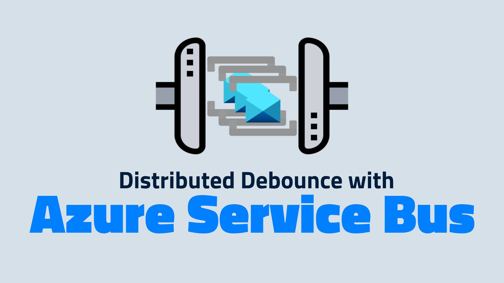
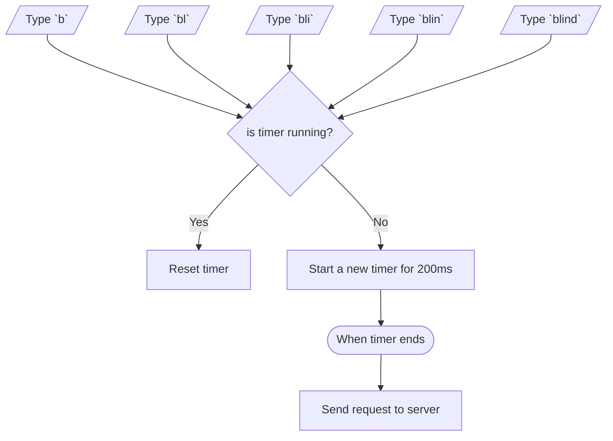
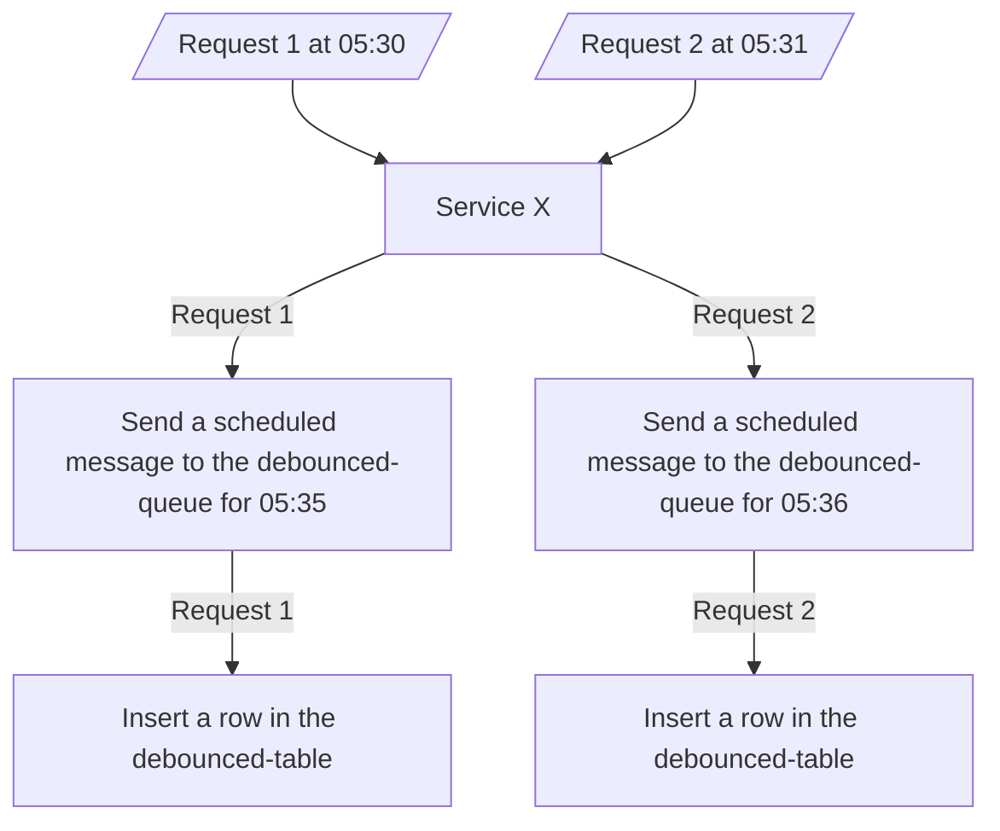
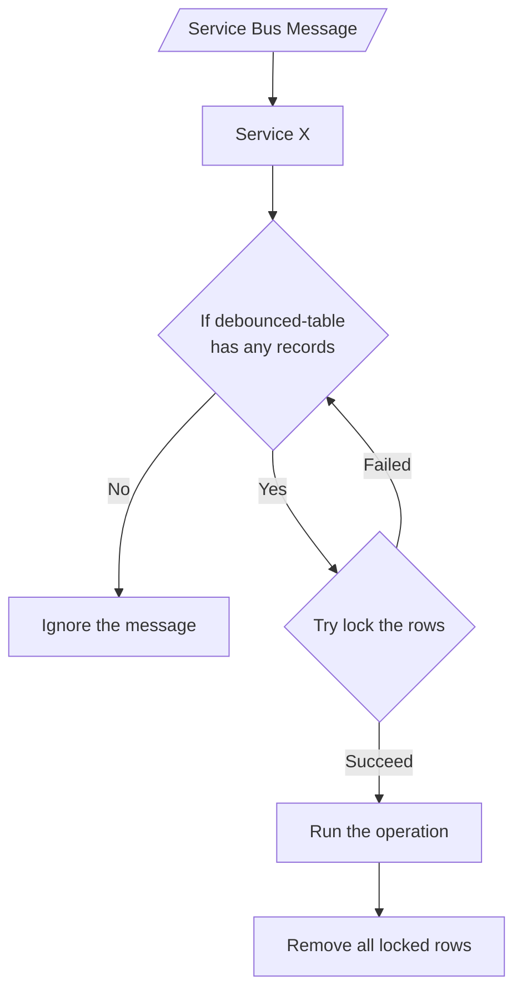

simple implementation of a distributed debounce with Azure Service Bus and Table Storage

## What is debounce?

In electronics when you press a mechanical switch, the contact may not settle immediately; it often makes and breaks contact several times within a few milliseconds. This is known as "bouncing", The bounce can cause multiple signals to be sent when only one was intended. For instance, pressing a button once might register as multiple presses due to the bouncing.

Debouncing refers to the process of removing noise or bounce that occur when a mechanical switch, such as a button, is pressed or released [ref](https://www.analog.com/en/resources/glossary/debounce.html).

In software, we don't have bouncy switches (Thanks to hardware engineers 😅), and debouncing refers to discarding inputs or events that occurred too close together.

A simple use case for debouncing is in a search bar on a website. As a user types, each keystroke could trigger a search request. This could lead to many unnecessary requests being sent rapidly, which can overwhelm the server.

Debouncing the search request ensures that it is only sent after the user stops typing for a short period, resulting in a single request to the server. This approach improves performance and provides a smoother user experience.

## What is distributed debounce?

When multiple nodes or services are involved, distributed debounce ensures that only one action is taken even if multiple nodes receive similar requests or signals within a short timeframe.

Even if your service is not distributed and only one instance is running, you shouldn't rely on an in-memory or local debouncing function. There's a good chance that the service could be restarted or redeployed, leading to the loss of the debouncing state.

For instance, imagine we have a service that receives a message from a database change feed whenever a user makes a change. This service gets triggered and needs to run another service that performs complex and heavy analysis over the entire data of the user's company and stores it somewhere. Without using debouncing, we could end up calling the analysis service repeatedly, even before the previous request has finished.

If I haven’t convinced you that you need distributed debounce in your fancy architecture, just picture this: everything’s running smoothly, but you’re itching to overengineer something. Voilà! Here’s the perfect excuse to turn a simple problem into a glorious, overcomplicated mess.

## Distributed debounce with Azure Service Bus and Table Storage

If you don't want to introduce a polling mechanism, especially if you're already using Azure Service Bus and want to avoid adding new stacks and dependencies to the project, you can implement a simple distributed debounce using Azure Service Bus and Azure Table Storage.

Basically, debouncing involves four parts:

1. Delaying the operation (to gather more requests)
1. Capturing requests
1. Running the operation
1. Discarding all captured requests

### 1. Delaying the operation

When the service receives a request, it will create a scheduled message at a future time in an Azure Service Bus Queue `debounced-queue` and store the corresponding information in Azure Table Storage `debounced-table`.

If the operation fails after sending the message to the Azure Service Bus Queue but before storing it in Azure Table Storage, the algorithm will ignore this failure, as described in the next section.

### 2. Capturing requests

When the first scheduled message is consumed from the `debounced-queue`, the service checks the `debounced-table`. If there are any active records, it will mark all of them as pending using a distributed locking mechanism to avoid concurrent execution. 

### 3. Running the operation & 4 Discarding all captured requests

The service then runs the operation, and upon completion, deletes all the pending rows.

If the operation fails during execution, the lock mechanism should release the locked rows in the `debounced-table`, and it is the caller's responsibility to handle the exception and retry. For example, you can configure Azure Service Bus to retry automatically, or use [Polly](https://www.thepollyproject.org/) to add resiliency. 

### 4. Discarding all captured requests - Part 2

If the `debounced-table` is empty, it means another message already processed all the requests and this one can be ignored.

## Table Schema

For the `PartitionKey`, we can use a static value to represent the operation key (e.g. `Analysis_{CustomerId}`) to ensure data distribution and keep all related data within the same logical partition. The `RowKey` must be unique for each request. A timestamp with the correct resolution (seconds or milliseconds) could already help reduce some noise.

## Locking Mechanism

Azure Table Storage supports optimistic concurrency, which can be used to implement a simple version of a distributed lock to satisfy our requirements.

By adding new columns to the `debounced-table` to store the Azure Service Bus message ID as the lock holder and the current time as the locking time, we can identify the state of the row.

## Reading

To query related rows from the table, we can read all rows that meet either of the following conditions:

1. They are locked by the current message (have the same lock holder).

   If the process is terminated due to an exception or service restart, it should be able to access the rows it previously locked.

1. The sum of the lock time and the operation time is less than the current time.

   If the process fails to complete for any reason, the rows need to be unlocked and made available again.

If the operation time exceeds a minute, a message could remain stuck in a locked state for an extended period without an active holder. To prevent this, you should use a short periodic timer to renew the lock consecutively. With this approach, if the operation is aborted, the next message can access the rows, ensuring that recovery time stays within a matter of minutes.

## Locking

First, we query the table to read all unlocked rows. Then, we attempt to update all rows with the lock holder and lock time if the ETag matches. If the operation completes successfully, it means we have locked the rows and can continue.

If the operation fails, we need to repeat the process, as another process has already made changes to the rows.

# Conclusion

In summary, implementing distributed debounce with Azure Service Bus and Azure Table Storage is a practical way to handle high-frequency operations without overloading your system. This setup keeps things smooth and efficient, ensuring that only one operation runs at a time, even in a distributed environment.