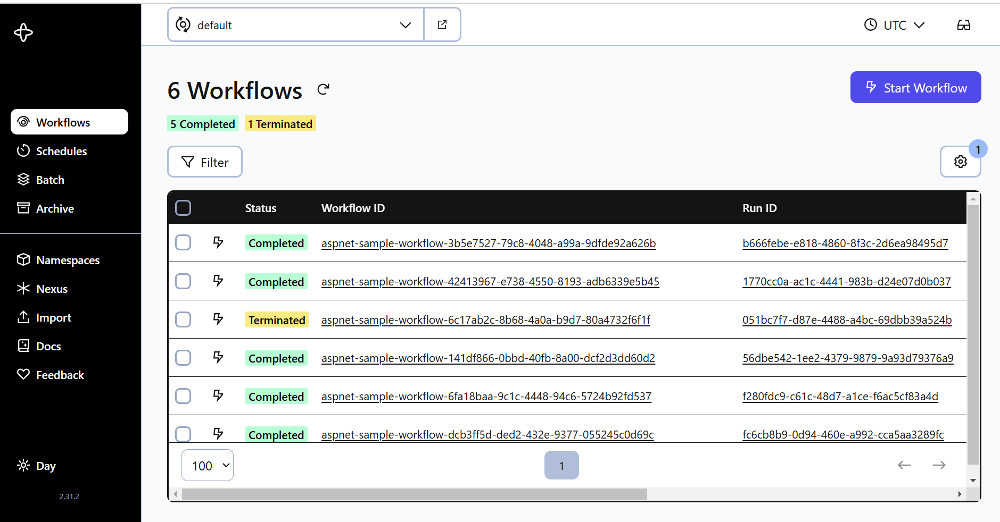

> TLDR
>
> check the repository : https://github.com/PejmanNik/durabletask-dotnet-aspnet
>
> or use NuGet package [Sisu.DurableTask.AspNetCore](https://www.nuget.org/packages/Sisu.DurableTask.AspNetCore/)

We recently migrated a large Azure Function app to ASP.NET Core. One of the biggest challenges we faced was handling durable functions, which were heavily used in the original application.

My initial idea was to replace durable functions with [MassTransit](https://masstransit.io) Sagas. However, after migrating one orchestration, I realized this was a naive approach. A few lines of code in a durable function ballooned into hundreds of lines of code in MassTransit. The MassTransit code also required additional explanation to be understandable, making it more complex and less readable. Additionally, we lost the excellent traceability and visibility features built into durable functions, such as the [Durable Functions Monitor](https://marketplace.visualstudio.com/items?itemName=DurableFunctionsMonitor.durablefunctionsmonitor).


*Durable Functions Monitor VSCode extension*

While MassTransit is a powerful tool and widely used in the community, it can be challenging to learn. It's almost not documented (requiring users to watch hours of videos), complicated, has a strong opinionated style and requires a lot of boilerplate code and explicit programming.

In essence, I was trying to fit a square peg into a round hole. While choreography and orchestration are both valuable patterns, they serve different purposes. Replacing our orchestration pattern with a choreography approach using MassTransit goes beyond simply changing frameworks. It requires a fundamental rethink of the code flow and architecture.

For our distributed data processor, the orchestration pattern was a better fit. I decided to keep the original design (for processes that can still benefit from orchestration, as Durable Functions are sometimes used to overcome Azure Functions' limited execution time). This meant I needed to somehow integrate Durable Functions into our ASP.NET Core application.

Durable Functions are built upon the foundation of the [Durable Task Framework](https://github.com/Azure/durabletask). However, the library lacks native support for crucial features to host it a ASP.NET Core application, like dependency injection and background services.

I found out that Azure Functions doesn’t actually use the Durable Task Framework directly. Instead, it relies on a wrapper library called [DurableTask-Dotnet](https://github.com/microsoft/durabletask-dotnet) which provides the necessary features. However, DurableTask-Dotnet is designed to work with Azure Functions and the [sidecar pattern](https://learn.microsoft.com/en-us/azure/architecture/patterns/sidecar):

> The Durable Task .NET Client SDK is a .NET Standard 2.0 library for implementing Durable Task orchestrations and activities. It's specifically designed to connect to a "sidecar" process, such as the Azure Functions .NET Isolated host, a special purpose sidecar container, or potentially even Dapr.

DurableTask-Dotnet acts as both a client and a worker for the orchestrator running in the sidecar (Azure Functions host). As a client, it schedules orchestrations in the orchestrator, and as a worker, it pulls tasks from the orchestrator and processes them. However, the actual orchestrator resides in the sidecar process. This means that using this package directly in an ASP.NET Core application won’t work because it lacks the orchestrator component.

After checking out DurableTask-Dotnet source code, I realized that it forwards requests from the client to the orchestrator using gRPC and retrieves queued tasks from the orchestrator via a background service through gRPC messages. My goal, however, was to create a new client and worker communicator that wouldn't rely on forwarding calls to the sidecar but would instead handle everything internally.

The Durable Task Framework already includes the orchestrator’s code. All I needed to do was create a shim wrapper around it and integrate it with DurableTask-Dotnet. Thanks to the well-abstracted design of library, The result was surprisingly simple and straightforward. You can check the [source code](https://github.com/PejmanNik/durabletask-dotnet-aspnet) or NuGet package [Sisu.DurableTask.AspNetCore](https://www.nuget.org/packages/Sisu.DurableTask.AspNetCore/).

Simply this is all you need to add to your application:
```csharp
var orchestrationServiceAndClient = new AzureStorageOrchestrationService(new()
{
    StorageAccountClientProvider = new StorageAccountClientProvider(durableTaskStorage),
    TaskHubName = "hub1",
    WorkerId = "worker1",
});

builder.Services.AddSelfHostedDurableTaskHub(orchestrationServiceAndClient);
builder.Services.AddDurableTaskWorker(builder =>
{
    builder
        .AddTasks(r => r.AddAllGeneratedTasks())
        .UseSelfHosted();
});

builder.Services.AddDurableTaskClient(b => b.UseSelfHosted());
```

It's important to note that keeping both the worker and client in the same application is generally not recommended. The load and scaling requirements for workers are typically different from those of clients. However, depending on the specific use case (As a true developer, I’ve learned that starting every answer with 'Well, it depends...' is the ultimate cheat code 😁 it’s impossible to be wrong!), it may be reasonable to run both components in the same application.

Finally, it's worth mentioning the [Temporal](https://temporal.io/) project, which I discovered during my research. Temporal offers a durable execution platform with advanced features and supports major programming languages with excellent documentation. Unlike the Durable Task Framework, it doesn’t lock you into a specific cloud vendor. However, Temporal's hosting requirements are quite complex, making setup more involved.


*Temporal UI*