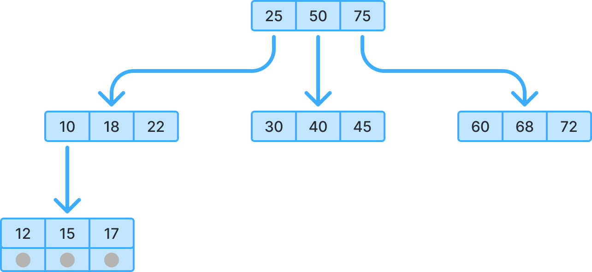

With the release of .NET 9, we finally got native UUID v7 support via [`Guid.CreateVersion7()`](https://learn.microsoft.com/en-us/dotnet/api/system.guid.createversion7). My first thought was: 
Great, this should finally make GUIDs sane for indexes in SQL Server. Well...


## What is the problem with GUIDs?

Generally, using random GUIDs (UUID v4) as clustered (or nonclustered) indexes in SQL Server is a terrible idea. SQL Server stores indexes as a sorted B-trees. When your key is completely random, every insert lands somewhere random too.

That means page splits, fragmentation, and plenty of extra I/O. Databases are fast, but once your table grows large and your insert rate climbs, this randomness quickly converts into a real performance problem.




The general solution is straightforward: use sequentially generated GUIDs. Entity Framework has shipped [`SequentialGuidValueGenerator`](https://github.com/dotnet/efcore/blob/main/src/EFCore/ValueGeneration/SequentialGuidValueGenerator.cs) for years. It generates GUIDs that are still random, while ensuring each new value sorts after the previous one (at least on the local machine).

SQL Server also provides [`NEWSEQUENTIALID()`](https://learn.microsoft.com/en-us/sql/t-sql/functions/newsequentialid-transact-sql), but its algorithm differs slightly.

> [!TIP]
> * [How a B-tree Search Works](https://btree.app/)
> * [What is Page?](https://www.sqlservercentral.com/articles/understanding-the-internals-of-a-data-page)
> * [Sql Server clustered and nonclustered index](https://www.geeksforgeeks.org/sql/clustered-and-non-clustered-indexing/)
> * During the research for this post, I found out that PostgreSQL [doesn't have clustered indexes](https://www.dbrnd.com/2016/12/postgresql-cluster-improve-index-performance-no-default-cluster-index-explicit-lock-physical-order-data/).

## UUID v7 is (practically) sequential

Based on the UUID specification, the text format is as follows where `v` is the version and `w` is the variant:

```
xxxxxxxx-xxxx-vxxx-wxxx-xxxxxxxxxxxx
```

Unlike UUID v4, where every `x` is random, UUID v7 stores the Unix timestamp (in milliseconds) in the first 12 `x` as hexadecimal digits. The remaining `x` are random. For example:
```
019ddfb1-8527-7b7e-93ea-6cefea2c3b90
019ddfb1-8527-7c34-b4fb-189eb2249446
019ddfb1-8527-7a5c-8627-af24f40e4b0f
019ddfb1-8527-79b4-ac9a-1be6cf8f58ef
```

Compared to UUID v4:
```
9836356a-2a23-4dd7-bdd3-7665633d1a4a
b85d8546-bcb0-4974-8239-d592b25af77c
dd2e0dbd-4f60-41ee-a102-c025e908afde
d4a45075-782f-4dd1-8a16-ec9fcd154153
```

At first glance, UUID v7 looks like exactly what we want. Sequential and standardized.

## SQL Server sorting is... special

Let's look at how EF Core's `SequentialGuidValueGenerator` works. If we check the code carefully, It only replaces the last 8 bytes of the GUID with sequential data. 

```csharp
...
var guidBytes = MemoryMarshal.AsBytes(new Span<Guid>(ref guid));

guidBytes[09] = counterBytes[0];
guidBytes[08] = counterBytes[1];
guidBytes[10] = counterBytes[7];
guidBytes[11] = counterBytes[6];
guidBytes[12] = counterBytes[5];
guidBytes[13] = counterBytes[4];
guidBytes[14] = counterBytes[3];
guidBytes[15] = counterBytes[2];
...
```

In other words, only the last 16 `x` change:

```
ea53f1f2-398b-40a7-7656-08dea6e9ba6d
7389f15d-d6fd-4d73-7657-08dea6e9ba6d
eb341e7a-e01a-4271-7658-08dea6e9ba6d
21ea3533-9194-41c9-7659-08dea6e9ba6d
04702e13-abe5-401d-765a-08dea6e9ba6d
```

This looks almost backwards compared to UUID v7. That is because of how the SQL Server sort algorithm works for `uniqueidentifier` columns.

SQL Server sorts `uniqueidentifier` values differently than pretty much everyone else. Instead of starting from the first byte, it gives highest priority to the last bytes. 


Based on. [Ordering of uniqueidentifier in sql server](https://web.archive.org/web/20120628234912/http://blogs.msdn.com/b/sqlprogrammability/archive/2006/11/06/how-are-guids-compared-in-sql-server-2005.aspx):

> we look at bytes {10 to 15} first, then {8-9}, then {6-7}, then {4-5}, and lastly {0 to 3}.


That is due to some historical reason and tied to RFC 4122, In the UUID v1 the last 6 bytes are node id, and the node id was based on a machine's MAC address so probably the sorting was designed to be most sensitive to the parts of the GUID that changed the least frequently or likely to group GUIDs by originating machine.

> [!TIP]
> [How many ways are there to sort GUIDs?](https://devblogs.microsoft.com/oldnewthing/20190426-00/?p=102450)


### Why UUID v7 is a poor index key in SQL Server

UUID v7 places its sequential timestamp in the first six bytes. Because of how SQL Server sorts `uniqueidentifier` values, UUID v7 behaves almost like UUID v4 in a SQL Server index. You still end up with random inserts, page splits, and fragmentation.

In our case, this simple change turned a production insert operation from 20 minutes into hours and created a fun afternoon for a colleague, who got to replace every `CreateVersion7()` call in the codebase.